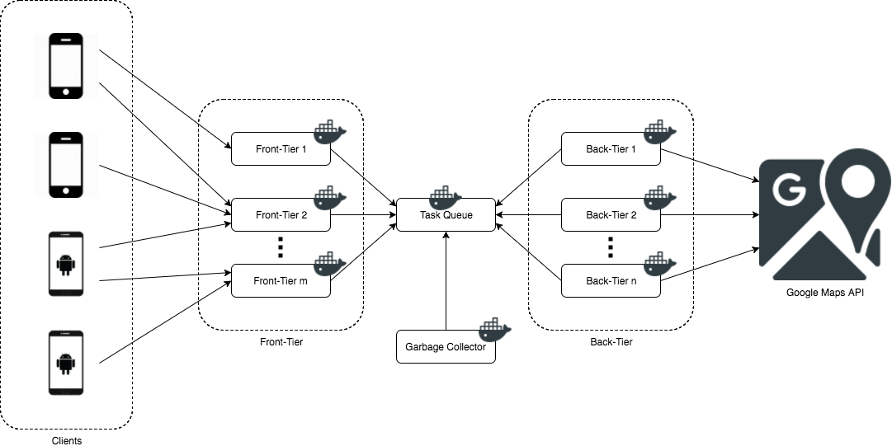

# Shortest Driving Path Project

Given a starting location and a list of drop-off locations, this project finds the shortest driving path by making use of a map provider (Google Maps Distance Matrix API) and applying a Travelling Salesman algorithm (brute force or Held & Karp).

## Author

SIU, Ching Pong (a.k.a. Asuka Kenji)

## License

Any commercial use of any part in this project is prohibited, except with the prior written approval of the author.

## Table of Contents

- [Getting Started](#getting-started)
  - [Building](#building)
  - [Running](#running)
- [System Architecture Diagram](#system-architecture-diagram)
- [Directory Structure](#directory-structure)
- [Project Structure](#project-structure)
  - [Front-Tier](#front-tier)
  - [Task Queue](#task-queue)
    - [Question](#question)
    - [Answer](#answer)
    - [Garbage](#garbage)
  - [Back-Tier](#back-tier)
  - [Garbage Collector](#garbage-collector)
- [Project Architecture](#project-architecture)
- [Dependencies](#dependencies)
- [To Be Improved](#to-be-improved)

## Getting Started

### Building

#### Building [Front-Tier](#front-tier)

Create a new directory and change the current directory to it:

    mkdir temp1
    cd temp1

Download the Docker config file `Dockerfile`:

    curl -O https://raw.githubusercontent.com/asukakenji/151a48667a3852a43a2028024ffc102e/master/cmd/frontier/Dockerfile

Download the app config file `frontier.json`:

    curl -O https://raw.githubusercontent.com/asukakenji/151a48667a3852a43a2028024ffc102e/master/cmd/frontier/frontier.json

Edit the config file to fit the environment.

Build the Docker image:

    docker build -t frontier-image .

#### Building [Back-Tier](#back-tier)

Create a new directory and change the current directory to it:

    mkdir temp2
    cd temp2

Download the Docker config file `Dockerfile`:

    curl -O https://raw.githubusercontent.com/asukakenji/151a48667a3852a43a2028024ffc102e/master/cmd/backtier/Dockerfile

Download the app config file `backtier.json`:

    curl -O https://raw.githubusercontent.com/asukakenji/151a48667a3852a43a2028024ffc102e/master/cmd/backtier/backtier.json

Edit the config file to fit the environment.

Build the Docker image:

    docker build -t backtier-image .

#### Building [Garbage Collector](#garbage-collector)

Create a new directory and change the current directory to it:

    mkdir temp3
    cd temp3

Download the Docker config file `Dockerfile`:

    curl -O https://raw.githubusercontent.com/asukakenji/151a48667a3852a43a2028024ffc102e/master/cmd/garbagecollector/Dockerfile

Download the app config file `garbagecollector.json`:

    curl -O https://raw.githubusercontent.com/asukakenji/151a48667a3852a43a2028024ffc102e/master/cmd/garbagecollector/garbagecollector.json

Edit the config file to fit the environment.

Build the Docker image:

    docker build -t garbagecollector-image .

### Running

#### Running [Task Queue](#task-queue)

    docker run schickling/beanstalkd

#### Running [Front-Tier](#front-tier)

    docker run frontier-image

#### Running [Back-Tier](#back-tier)

    docker run backtier-image

#### Running [Garbage Collector](#garbage-collector)

    docker run garbagecollector-image

## System Architecture Diagram

Visit [here](https://drive.google.com/file/d/0B6JV6ICUUqcuQ1B0M3FQLUk2ZkU/view?usp=sharing) for full-size diagram.

## Directory Structure

    + (project root)
    ├── bitstring
    ├── cmd
    │   ├── backtier
    │   │   ├── internal
    │   │   │   └── getdm
    │   │   └── lib
    │   ├── frontier
    │   │   └── lib
    │   └── garbagecollector
    ├── common
    ├── constant
    ├── matrix
    ├── taskqueue
    └── tsp
        ├── bruteforce
        └── heldkarp

- `bitstring`: Contains algorithms for bit string manipulations intended to be used by Held & Karp algorithm (Dynamic Programming algorithm) for Travelling Salesman Problem.
- `cmd/backtier`: Contains the backbone logic of [Back-Tier](#back-tier).
- `cmd/backtier/internal/getdm`: Contains a short program for testing Google Maps API.
- `cmd/backtier/lib`: Contains functions called by the backbone of [Back-Tier](#back-tier).
- `cmd/frontier`: Contains the backbone logic of [Front-Tier](#front-tier).
- `cmd/frontier/lib`: Contains functions called by the backbone of [Front-Tier](#front-tier).
- `cmd/garbagecollector`: Contains the implementation of [Front-Tier](#front-tier).
- `cmd/common`: Contains code shared by [Front-Tier](#front-tier), [Back-Tier](#back-tier), and [Garbage Collector](#garbage-collector).
- `cmd/constant`: Contains constants used by the project.
- `cmd/matrix`: Contains algorithms for matrix operations intended to be used by Branch-and-Bound algorithm for Travelling Salesman Problem.
- `cmd/taskqueue`: Contains APIs for accessing the [Task Queue](#task-queue).
- `cmd/tsp/bruteforce`: Contains a brute force algorithm (trying all permutations) for Travelling Salesman Problem.
- `cmd/tsp/heldkarp`: Contains an implementation of Held & Karp algorithm (Dynamic Programming) for Travelling Salesman Problem.

## Project Structure

The project is mainly divided into 4 parts:

- [Front-Tier](#front-tier) (`frontier`)
- [Task Queue](#task-queue) (`taskqueue`)
- [Back-Tier](#back-tier) (`backtier`)
- [Garbage Collector](#garbage-collector) (`garbagecollector`)

### Front-Tier

Front-Tier is an HTTP server responsible for accepting requests from the clients. There are 2 kinds of requests.

The first kind contains a starting location and a list of drop-off locations. The client would like to know the shortest driving path which begins from the starting location, and visits all drop-off locations once. After receiving a request from the client, Front-Tier generates a token and sends the Question to Task Queue for being retrieved by Back-Tier. It then sends back the token to the client immediately so that it could come back for the result.

The second kind contains a token. Front-Tier looks up Task Queue and returns the Answer to the client.

### Task Queue

Task Queue deals with 3 kinds of entities:

#### Question

Question is received from Front-Tier (and in turn, from the request of the client). It contains the starting location and a list of drop-off locations.

#### Answer

Answer is received from Back-Tier. It contains the status of the query, the shortest driving path, or the error occurred during the process.

#### Garbage

Garbage is received from Back-Tier. It contains information to help cleaning up entries no longer useful in Task Queue.

### Back-Tier

Back-Tier is responsible for finding the solution for the query. After receiving a Question from Task Queue, it retrieves a distance matrix via the map provider. Then it calculates the shortest driving path by applying a Travelling Salsman algorithm. After that, it sends the Answer to Task Queue for being retrieved by Front-Tier.

### Garbage Collector

Garbage Collector is responsible for cleaning up Task Queue. Questions and Answers that are too old are deleted to free the memory they used.

## Project Architecture

TODO: Write this (description)

## Dependencies

### Gorilla Mux

Gorilla Mux implements an HTTP request router and dispatcher. It is used to implement Front-Tier.

- Website: http://www.gorillatoolkit.org/pkg/mux
- GitHub: https://github.com/gorilla/mux

### Beanstalk

Beanstalk is a simple, fast work queue (task queue / job queue). It is used to implement Task Queue.

- Website: https://kr.github.io/beanstalkd/
- GitHub (Server): https://github.com/kr/beanstalkd
- GitHub (Client): https://github.com/kr/beanstalk

### Google Maps Distance Matrix API

Google Maps Distance Matrix API provides duration and distance values based on the recommended route between start and end points. It is used to implement Back-Tier.

- Website: https://developers.google.com/maps/documentation/distance-matrix/
- GitHub: https://github.com/googlemaps/google-maps-services-go

### UUID package for Go language

This package provides pure Go implementation of Universally Unique Identifier (UUID). It is used in the `common` package to generate new tokens.

- GitHub: https://github.com/satori/go.uuid

### Google Logging Module

Google Logging Module provides leveled execution logs for Go. It is used everywhere in the project. It is the main logging mechism.

- GitHub: https://github.com/golang/glog

## To Be Improved

- Write a connection pool for Task Queue.
- Orchestra to make the tiers to be-born if down.
- Implement Branch-and-Bound to support more locations, and use less memory, and use shorter execution time.
- Use the Golang `"context"` mechanism to limit the runtime of each task.

TODO: Write this
